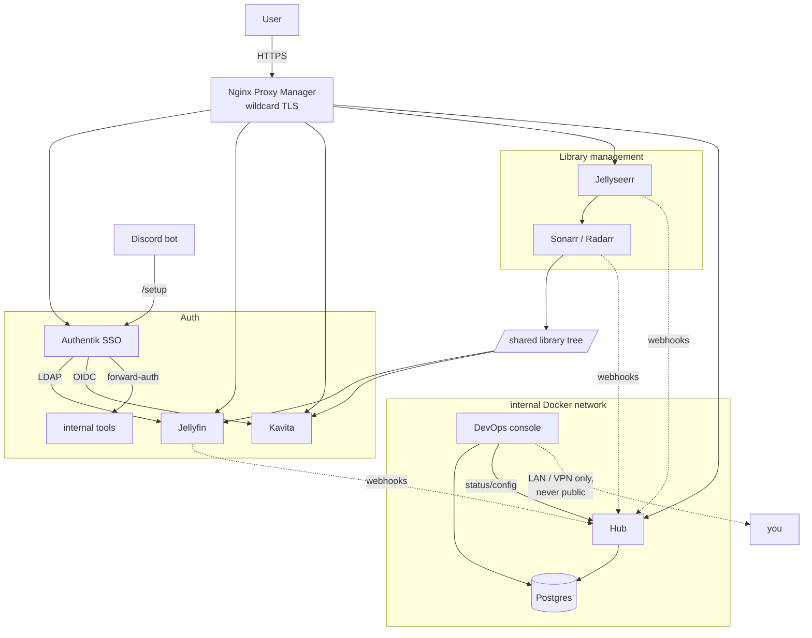

# Self-Hosted Media Platform

[](https://github.com/sanseryf/self-hosted-media-platform/actions/workflows/ci.yml)

A self-hosted media platform for a small private group: stream video, read
books and comics, request new titles, and manage access, all behind a
single sign-on. Next to the member-facing apps sits a custom ops layer (an
event-driven integration service, a live stats dashboard, and an async admin
console) that keeps the whole thing honest.

This repo has the **architecture docs** for the whole build, the **full source
of Hub** (the custom integration platform that ties the off-the-shelf pieces
together), a **one-command demo** you can run locally, and **case studies** of
real incidents. Everything is sanitized: every host, key and token is a
placeholder.


## Try it in one command

```bash
docker compose -f demo/docker-compose.yml up --build
# open http://localhost:8080 and sign in as demo / demo
```

The demo runs the real Hub image against mock upstreams and fictional data,
with no internet or media server needed. A seeder drives it through the public
webhook API, so the request lifecycle, reconciler and approval policy are
doing real work. CI runs the same stack and smoke-tests it on every push.
**[What the demo shows →](demo/)**

| | |
|---|---|
|  |  |
| **Request journey.** Every request on its state ladder, with stalls flagged | **Live wall.** Who's watching what, over server-sent events |
|  |  |
| **The instrument.** Library growth and watch time by genre | **Uptime.** A 30-day board per service, including the seeded incidents |

## Case studies

Real incidents from running this, written up as blameless postmortems:
[an onboarding flow that silently stopped granting access](case-studies/01-onboarding-role-gap.md),
[a total outage from a single WiFi link](case-studies/02-network-loss.md),
[a 16-hour GPU driver failure nobody saw](case-studies/03-gpu-driver-after-kernel-upgrade.md),
[a backup that never contained the SSO database](case-studies/04-backup-gap-and-restore-drill.md),
and more. **[All case studies →](case-studies/)**

## Start here: [`hub/`](hub/) — the interesting part

The off-the-shelf apps (Jellyfin, Kavita, the *arr stack) are configuration.
**Hub is the engineering.** It's an event-driven integration platform over four
third-party APIs that answers what none of them can alone: *where is my request
right now, do these systems still agree with each other, and should this have
been auto-approved?*

- **L1** — idempotent, self-authenticating webhook receiver into one Postgres
  inbox, with a dead-letter path
- **L2** — typed connector gateway: one normalized contract over four APIs, with
  retry/backoff and an explicit error taxonomy
- **L3** — per-title state machine (`requested → … → played`) that survives
  out-of-order delivery, a three-way reconciler for drift between Jellyfin / the
  *arr apps / disk, and a policy auto-approver that **ships in shadow mode**
- **L4** — the member-facing payoff: landing page, live SSE wall, request
  journey, in-browser player with watch-together sync

FastAPI + asyncpg, one container, no build step. The pure logic (parsers, state
machine, set-diff, caches) is separated from its I/O and unit-tested without a
database — CI runs the full suite against a real Postgres service container.

**→ [Read the Hub README](hub/README.md)** for the design decisions and the
trade-offs behind them.

## What it does

| Capability | Tool | User-facing URL |
|---|---|---|
| Movies / TV streaming | Jellyfin | `watch.example.org` |
| Books / comics reading | Kavita | `read.example.org` |
| Movie/TV requests | Jellyseerr | `request.example.org` |
| Member site + integration platform | **[Hub](hub/)** (custom app, source here) | `example.org` (apex) |
| Single sign-on / identity | Authentik | `id.example.org` |
| Reverse proxy + TLS | Nginx Proxy Manager | (edge) |
| Lookups + self-service onboarding | Discord bot (custom) | Discord |
| Infrastructure monitoring + admin | **DevOps console** (custom app) | LAN/VPN only, never public |

Behind Jellyseerr sit Sonarr and Radarr, which organize TV and movies into a
common library tree the media servers watch.

**Hub** ([source](hub/)) is both halves of the member experience and the
operator one: the apex site people sign into — browse, play in-browser, watch
together — and the event-driven platform underneath it that correlates all four
video systems into a single view of what's actually happening. It's backed by a
dedicated Postgres instance.

**DevOps console** is a live monitoring + one-click admin dashboard — container
health, library-manager queues, account diagnostics, and a handful of guarded
admin actions (container restart/update, password reset, Discord role grant). It
is never exposed publicly.

## Architecture at a glance



## Documentation index

1. [Architecture](docs/01-architecture.md) — components, data flow, network model
2. [Containerization on Linux](docs/02-containerization-on-linux.md) — Docker/Compose conventions, bind mounts, permissions, deploy workflow
3. [Reverse proxy & TLS](docs/03-reverse-proxy-and-tls.md) — Nginx Proxy Manager, wildcard certs, DNS
4. [Single sign-on with Authentik](docs/04-sso-with-authentik.md) — LDAP vs OIDC vs forward-auth, enrollment, gotchas
5. [Discord integration](docs/05-discord-integration.md) — lookups and self-service onboarding (`/setup`)
6. [Deployment runbook](docs/06-deployment-runbook.md) — end-to-end, copy-paste with placeholders
7. [Data platform](docs/07-data-platform.md) — the hub + Postgres foundation for SQL projects
8. [DevOps console & monitoring](docs/08-devops-console-and-monitoring.md) — the async admin dashboard, why it's not public, what it can and can't do

Also: [**Demo**](demo/) — run Hub locally against mock upstreams · [**Case studies**](case-studies/) — incident write-ups · [More screenshots](docs/screenshots/)

## Engineering highlights

- **One identity, three protocols.** A single Authentik instance federates a
  media stack that speaks three different auth dialects — LDAP (Jellyfin), OIDC
  (Kavita), and reverse-proxy forward-auth (internal tools) — chosen per app for
  the best UX rather than forcing one pattern everywhere.
- **Infrastructure as folders.** Every service is a self-contained
  `docker-compose.yml` in its own directory sharing one library mount, giving
  clean imports and a trivial, reproducible deploy story.
- **Async end-to-end.** Every custom app (Hub, DevOps console)
  runs on FastAPI + asyncpg. The monitoring console started as a stdlib
  `http.server` script and was migrated to match once it grew consequential
  enough to be worth the same rigor as everything else — a rewrite done in
  seven independently-verified, git-committed phases with zero downtime.
  Deep dive: [ops-console-async-migration](https://github.com/sanseryf/ops-console-async-migration).
- **Single source of truth, not three copies.** The four member-facing "doors"
  (watch/read/request/browse) used to be defined independently in the landing
  page, the stats collector, and the admin console. They're now one config
  file both apps read, and the admin console asks the landing page's own
  status collector for live up/down state instead of re-checking everything
  itself on a separate schedule — same data, checked once, not three times.
- **Correlation over polling.** Four systems each know one slice of a request's
  life and none knows the whole. Rather than polling four APIs on a timer, Hub
  ingests their webhooks into one idempotent inbox and correlates them into a
  per-title state machine — so "stalled between approved and available", the
  failure every individual app reports as success, becomes a query.
  ([hub/](hub/))
- **Pure logic, separated and tested.** The state machine, the payload parsers,
  the three-way diff, and the auto-approve rules are database-free modules with
  their own unit tests. Out-of-order webhook delivery is a test case, not a
  production surprise.
- **Demos are tests.** Hub can't be shown without exposing a private server,
  so the repo ships a demo that drives the real image through its public
  webhook API. Building it surfaced two production bugs that unit tests had
  missed: TV requests splitting into two titles, and an `ON CONFLICT` that
  never matched a partial index. Both are fixed with regression tests, and
  the demo runs in CI. ([write-up](case-studies/06-demo-found-two-production-bugs.md))
- **Dangerous features ship disabled.** The Jellyseerr auto-approver runs in
  shadow mode — logging the decision it *would* have made — until
  `POLICY_ENFORCE=true`. An automation you can't audit before trusting is one
  that shouldn't be making decisions yet.

## Adapting this for yourself

Everything marked `<LIKE_THIS>` or `example.org` is a placeholder. Start with
the [deployment runbook](docs/06-deployment-runbook.md), which lists every value
you need to supply and where to get it.
