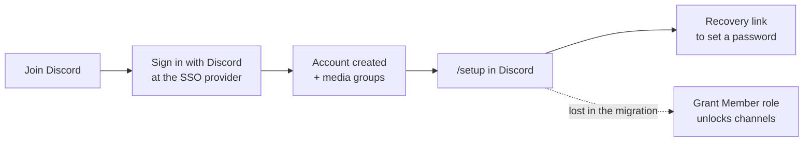

# New members could sign in but couldn't see anything

**Type:** silent functional regression · **Area:** identity and onboarding ·
**Detected by:** a new member reporting empty channels · **Status:** fixed

## Summary

New members finished signup, got a working account, and then found the
community's request channels hidden. The step that granted them the Discord
**Member** role had been lost when onboarding moved to a new flow. Every
dashboard stayed green the whole time, because the health check was still
testing the old flow.

## How onboarding works

The original flow used an invite tool that, as one of its steps, granted the
Member role. Onboarding was later rebuilt around the SSO provider's Discord
login plus a `/setup` command in the bot. Account creation, groups and
passwords all moved across. The role grant didn't, because it had only ever
existed inside the retired tool.

## Root cause

- The bot's `/setup` handler looked up the member's linked account and minted
  a password link. Nothing in it touched Discord roles (confirmed by reading
  the file end to end, not by searching for a function name).
- The admin console built its member list from the **retired** tool's API.
  Members who enrolled through the new flow showed as "not linked", so the
  console's one-click *Grant role* button was disabled for exactly the people
  who needed it.
- The "signup health" check walked the retired path: invite tool container,
  its signup page, the old bot. All green, while nobody could get in.

## Why it survived

Three reference docs still said the old tool granted the role. A fourth
section of the same doc described the new flow. The contradiction was even
listed in the doc-conflict table and marked *unresolved*. An unresolved
contradiction in the source of truth is how a load-bearing step disappeared
without anyone noticing.

## Fix

1. **Re-homed the role grant.** `/setup` now grants Member right after it
   confirms the Discord account is linked to an enrolled user. That lookup is
   the authorization proof, so the role can never reach someone who hasn't
   enrolled, and no new state is needed. It runs *before* the password-link
   call, so a flaky link endpoint can't also leave a verified member locked
   out of the channels. It's idempotent, and it fails soft: if Discord refuses,
   the member still gets their password link plus a one-line note.
2. **Repointed the admin console at the SSO provider** as the source of truth
   for who is linked, keeping the old tool only as a fallback for early
   members. "No Discord role" and "not in the media group" are now first-class
   issues on the Accounts tab.
3. **Rebuilt the health check to walk the live flow.** SSO reachable → API
   token valid → enrollment groups present → bot running → *members actually
   hold the role* → media server. The last step checks the outcome rather than
   whether a dependency is up.
4. **Corrected all three docs** and closed the conflict-table row.

## Verification

The deploy script refuses to run unless both changed files contain the new
functions, so a stale copy can't ship. After deploying, it `exec`s into the
running container and greps the live code for the new function, so a stale
image can't pass itself off as a successful deploy. 8 of 8 checks passed.

## Follow-ups

- The bot needed *Manage Roles*, with its role ranked above Member. Until an
  admin set that, every grant hit the soft-fail path.
- Signup no longer has an admission gate (the old invite link was the gate).
  Recommended: add an invitation stage to the SSO enrollment flow.

## Lessons

- **Health checks must test outcomes, not dependencies.** "Everything is up"
  and "people can get in" are different claims.
- **A conflict in the docs is an open bug,** not a note for later.
- **When a flow is migrated, list every side effect of the old one**, not only
  its main job.
