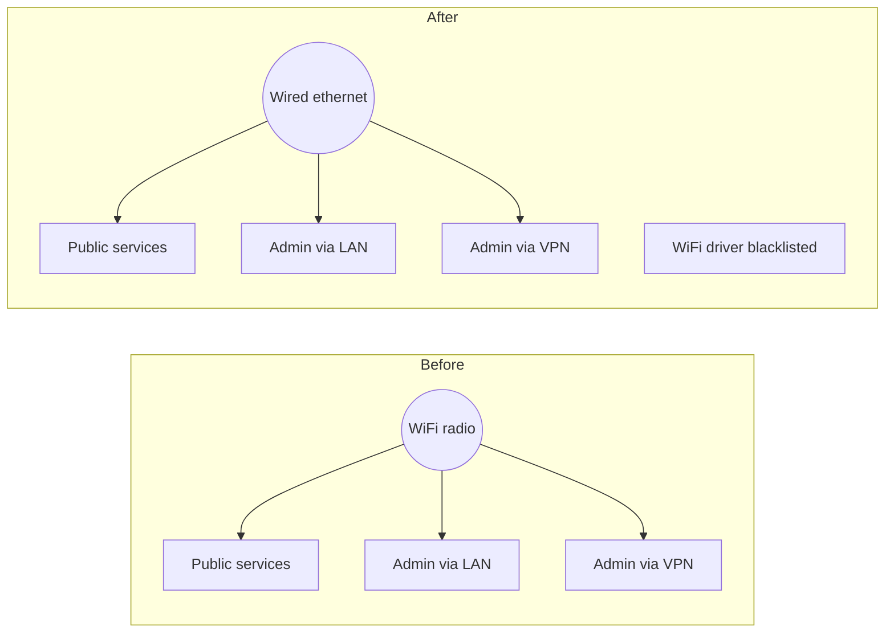

# Total outage: the server's only network link was a WiFi radio

**Type:** full outage · **Area:** host networking · **Detected by:** a person
trying to use the platform · **Status:** resolved, follow-ups tracked

## Summary

The server's WiFi firmware crashed and the kernel removed the network
interface entirely. Every public service went down, and so did both admin
paths (LAN SSH and the VPN), because all of them ran over that one radio. The
38 containers kept running throughout and no data was lost. Recovery needed
someone at the machine to plug in an ethernet cable that had never been
connected.

**The finding that matters isn't the crash. Every handoff doc said the server
was on wired gigabit ethernet, and it wasn't.**

## Timeline

| Step | What happened |
|---|---|
| Uptime 3d 7h 48m | Kernel logs `iwlwifi … microcode sw error detected`; the wireless interface disappears |
| Detection | The operator's normal connect command fails with `No route to host` |
| Triage | `ping` gets "Destination host unreachable" **from the operator's own PC**: an ARP failure, not a reply from the server. `arp -a` has no entry |
| Triage | At the physical console: `uptime` matches the kernel timestamp, so the error is live, not old ring-buffer output |
| Triage | `ip -brief addr` shows only `lo`, Docker bridges, and the ethernet port as `DOWN`. No wireless interface at all |
| Triage | `ip link show <eth>` shows `NO-CARRIER`: no cable in the port |
| Fix | Cable connected, link up, `netplan apply` |
| Verify | All 38 containers running, VPN up, public site returns 200 |

## Root cause

A known failure mode of this Intel wireless chipset: the firmware faults, the
driver's reset fails, and the interface is torn down until a module reload or
reboot. On a laptop that's a nuisance. Here it was a full outage because of a
structural fact:

> One network interface was in service, and it was a consumer WiFi radio. The
> admin path ran over the same link as the traffic, so the failure took out
> the channel needed to diagnose it.

## Why triage started in the wrong place

The first 15–20 minutes went on wired-network theories (cable seating, switch
ports, link lights), because three reference docs described the machine as
wired. None of them mentioned a wireless interface. It was a documented fact
that nobody had ever measured, and it cost time during a live outage.

**One thing went right:** a lesson from an earlier incident held. The kernel
timestamp was checked against `uptime` before acting on it, which established
that the error was current rather than stale console output.

## Follow-ups

1. Move the DHCP reservation to the ethernet port's MAC, so the server's LAN
   address is stable again.
2. Blacklist the wireless driver. The radio is redundant now, and its crash
   spam makes the console hard to read in exactly the situations where the
   console is the only interface.
3. Correct the hardware facts in all three docs and log the gap in the
   doc-drift register.
4. Confirm dynamic DNS recovered after the outage.
5. Check that no config hard-codes the old interface or address.
6. Add an **off-box** link-loss alert. This outage was found by a person
   trying to use the service. A watchdog that runs on the box can't report
   that the box is unreachable.

## Lessons

- **The admin path must not ride on the most failure-prone link.**
- **Check kernel timestamps against `uptime` before believing the console.**
  The same one-line check has caught both a stale error and a live one.
- **"Reply from *your own IP*: Destination host unreachable" is an ARP
  failure.** Windows counts it under *Received*, which makes it look like
  partial connectivity. It isn't.
- **Documented hardware facts are claims until measured.**
