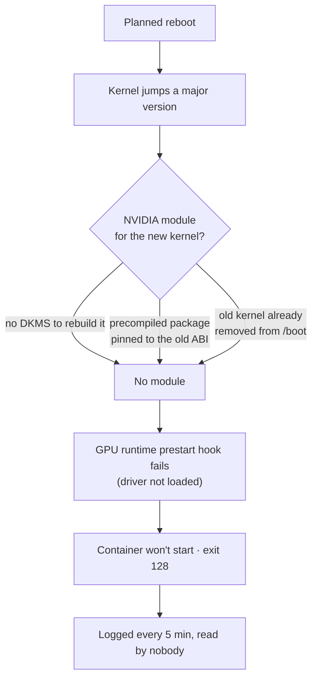

# Media server down for 16 hours after a kernel upgrade, and nothing said so

**Type:** outage plus silent failure · **Area:** host OS, GPU drivers,
monitoring · **Duration:** ~16 hours · **Status:** resolved, hardened

## Summary

A planned reboot (to clear swap and apply new Docker daemon settings) also
picked up a pending **major** kernel upgrade. The NVIDIA kernel module didn't
follow it, so the GPU container runtime refused to start the media server. The
container's failure was logged every five minutes for 16 hours, about 200
times, into a journal nobody read. Every dashboard stayed green.

## Impact

The video service returned 502 for about 16 hours. Every other service stayed
healthy.

## Root cause

Four things lined up:

- `dkms` wasn't installed, so nothing could rebuild the module for a new
  kernel.
- The driver came from precompiled packages that only work with one kernel
  version.
- The last working kernel had already been removed, so "boot the old kernel"
  wasn't an option.
- Driver packages were half-upgraded between two major series.

## Why it went unnoticed

The media server was the **only** container without a compose file, so
nothing recreated or retried it at boot the way every other stack was
handled. The admin console did log the failure, but it logged it to the
journal, not to anything a person looks at.

This was the second silent failure in two days. A different service had been
down for three weeks before anyone noticed. Both were visible in the logs and
invisible on every dashboard.

## A misdiagnosis worth recording

The first theory was that a memory limit applied the day before had broken
the container, because the timing matched exactly. Three rounds of relaxing
and then removing the limits changed nothing. The real error only appeared
once the container was started with its output captured instead of
suppressed. **Timing correlation isn't causation, and a suppressed error costs
more than untidy output.**

## Resolution

1. Installed the precompiled module for the running kernel and loaded it.
2. Started the container. Confirmed `nvidia-smi` works inside it, so hardware
   transcoding was intact.
3. Verified the health endpoint locally and the public URL end to end.

## Hardening

- **DKMS installed,** so future kernel changes rebuild the module
  automatically.
- **Kernel meta-packages held.** A server whose GPU is load-bearing shouldn't
  take a major kernel bump unattended. Unhold deliberately, in a maintenance
  window, with someone watching.
- **Compose file generated for the media server,** so it recovers like every
  other stack.
- **Cleanup deferred on purpose.** The duplicate module provider and the
  half-installed driver series were left until the next planned window.
  Touching a working GPU stack the same afternoon it was repaired is how a
  fixed problem becomes a new one.
- **A diagnostics view went from "nice to have" to "overdue".** It surfaces
  repeated container errors on the console rather than in the journal.

## Lessons

- **A log that nobody reads isn't monitoring.**
- **Capture the error before forming a theory.**
- **Know which dependencies are tied to the kernel version** before you
  reboot.
