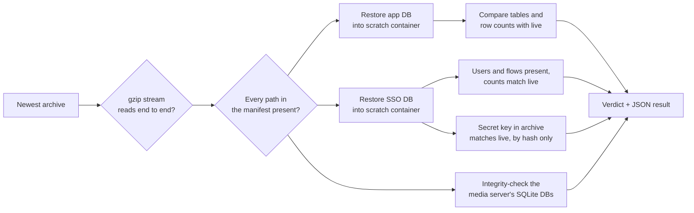

# The SSO database was never in the backups

**Type:** latent data-loss risk · **Area:** backup and recovery · **Found
by:** a new automated restore drill · **Status:** fixed, drill runs monthly

## Summary

Nightly backups ran and reported success every night. They included the SSO
provider's config file but **not its database**, which holds every user, login
flow and application. Losing the root disk would have meant rebuilding sign-on
from scratch. The gap was found by building a drill that actually restores the
backups, rather than just checking that they exist.

## Why nothing caught it

| Backup mechanism | What it covered | Why it missed SSO |
|---|---|---|
| File backup script | Directories on disk | The SSO database lives in a Docker **named volume**, which a directory search can't see |
| `pg_dumpall` | The main app's Postgres container | The SSO provider runs its **own** Postgres container |
| Nightly app dump | Main app DB only | Same |

Every archive contained the SSO `.env` file, so a casual check showed "SSO is
in the backup". The secrets were there. The data they unlock wasn't.

## Fix

The backup job now runs `pg_dump -Fc` **inside** the SSO database container,
using that container's own environment. No credential passes through the
script. Verification fails if the dump is missing or suspiciously small.

## The restore drill

A backup you've never restored is a hope, not a backup. The drill restores the
newest archive into throwaway containers and checks that the data actually
comes back.

Design choices:

- **Isolated.** Scratch containers run with `--network none`, a 1 GB memory
  cap, and a label so leftovers from an interrupted run are always cleaned up.
- **Same image as production,** so the restore exercises the real database
  version.
- **Secrets are compared by hash and never printed.**
- **Rows added since the backup count as normal activity,** not failures.
- **Machine-readable result.** The status command shows the last verdict and
  flags a drill more than 40 days old.
- **Clear exit codes:** 0 = restorable, 1 = a check failed, 3 = the drill
  couldn't run. "Couldn't check" never looks like "passed".
- **Scheduled monthly,** wrapped in a health-check ping, so a drill that
  silently stops running is itself an alert.

## Testing the drill itself

Tested offline against a fake Docker command backed by local Postgres 16
clusters. The happy path passes; an archive missing the SSO dump fails; a
truncated archive fails; the JSON result is written on every path; scratch
clusters are removed every time.

## Lessons

- **"The backup job succeeded" and "we can restore" are different claims.**
  Only a restore proves the second one.
- **Named volumes and per-service databases are where backup coverage leaks.**
- **A check that can't run must say so** rather than report green.
