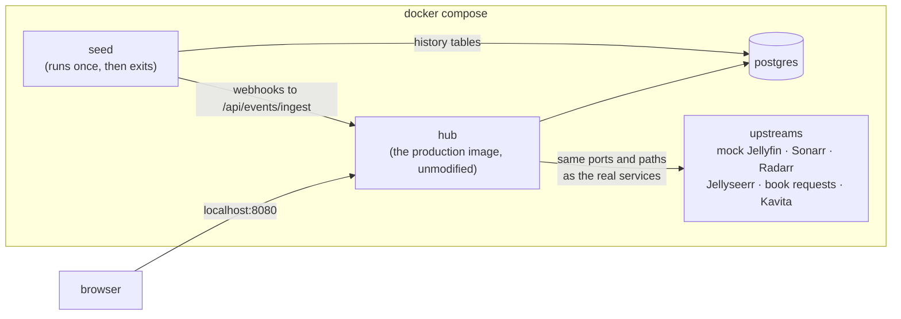

# Hub demo

Run the real Hub on your own machine, against mock upstreams and fictional
data, in one command:

```bash
docker compose -f demo/docker-compose.yml up --build
```

Then open <http://localhost:8080> and sign in as **demo / demo**.

Nothing in the demo reaches the internet or a real media server. Every
title, person and poster is invented, and the posters are generated SVGs.

## What runs



| Service | What it is |
|---|---|
| `hub` | Built from [`hub/`](../hub/) with no demo-specific code paths. |
| `upstreams` | [`mock_upstreams.py`](upstreams/mock_upstreams.py): one process listening on each upstream's usual port, serving the endpoints Hub calls. |
| `seed` | [`seed.py`](seed/seed.py): writes the history a real server builds up over months, then drives the event pipeline through Hub's public API. |
| `postgres` | Stock Postgres 16. |

## What the seeder does

1. **Writes history directly.** In production, library growth, watch time and
   uptime come from cron jobs running for months. The seeder writes 120 days of
   library snapshots, 60 days of watch sessions, and 30 days of uptime samples
   with two incidents.
2. **Drives the pipeline through the real API.** It POSTs Jellyseerr, Sonarr,
   Radarr and Jellyfin webhook payloads to `/api/events/ingest`. Those include
   an out-of-order retry and one malformed payload, which lands in the
   dead-letter queue. It then asks Hub to drain the inbox, run the reconciler,
   and evaluate pending requests against the approval policy. The lifecycle
   rows you see are the state machine's own output.
3. **Spreads timestamps over the past few days** so the request journey reads
   like history, and one title is past its stall threshold.

## Things to look at

| Where | What you'll see |
|---|---|
| Home | Hero rail, the three live sessions, recently added |
| `Ctrl+K` | Command palette: search the library, request titles, open views |
| Avatar menu → **The instrument** | Library growth, watch time by genre, a 30-day uptime board with the two seeded incidents |
| `/static/journey.html` | Each request on its state ladder; one is flagged **stalled** |
| `/static/wall.html` | The live "now playing" wall over server-sent events |
| `/api/reconcile/findings` | Drift between the media server and the library managers. Two cases are planted: a file that was imported but never indexed, and a title added by hand that no manager tracks |
| `/api/policy/decisions` | The auto-approver's decision on a pending request, made in shadow mode |
| `/api/events/dead` | The malformed webhook, kept rather than dropped |

## What the demo doesn't do

Playback. There is no video to stream, so the in-browser player and
watch-together rooms open but have nothing to play.

## Bugs it caught

Building the demo meant running the pipeline end to end against realistic
payloads for the first time. That surfaced two production bugs, both now fixed
with regression tests:

- **TV requests split into two titles.** Jellyseerr labels TV as `tv`, while
  Sonarr and Jellyfin say `series`. Lifecycle stitching requires matching
  types, so every TV request created one row that stayed at *requested* and
  a second row that actually progressed. Fixed by normalizing `media_type` at
  ingest ([`event_sources.py`](../hub/backend/event_sources.py)).
- **Policy decisions were never stored.** The `policy_decisions` unique index
  is partial (`WHERE event_id IS NOT NULL`), and Postgres only uses a partial
  index for `ON CONFLICT` when the statement repeats its predicate. Every
  insert raised, so the audit log stayed empty and the same request was
  re-evaluated on every run ([`policy.py`](../hub/backend/projects/policy.py),
  [`test_policy_store.py`](../hub/backend/tests/test_policy_store.py)).

## Checking it

```bash
python demo/smoke_test.py http://localhost:8080
```

The smoke test signs in and asserts that every screen has data. CI runs it
against the compose stack on every push.
