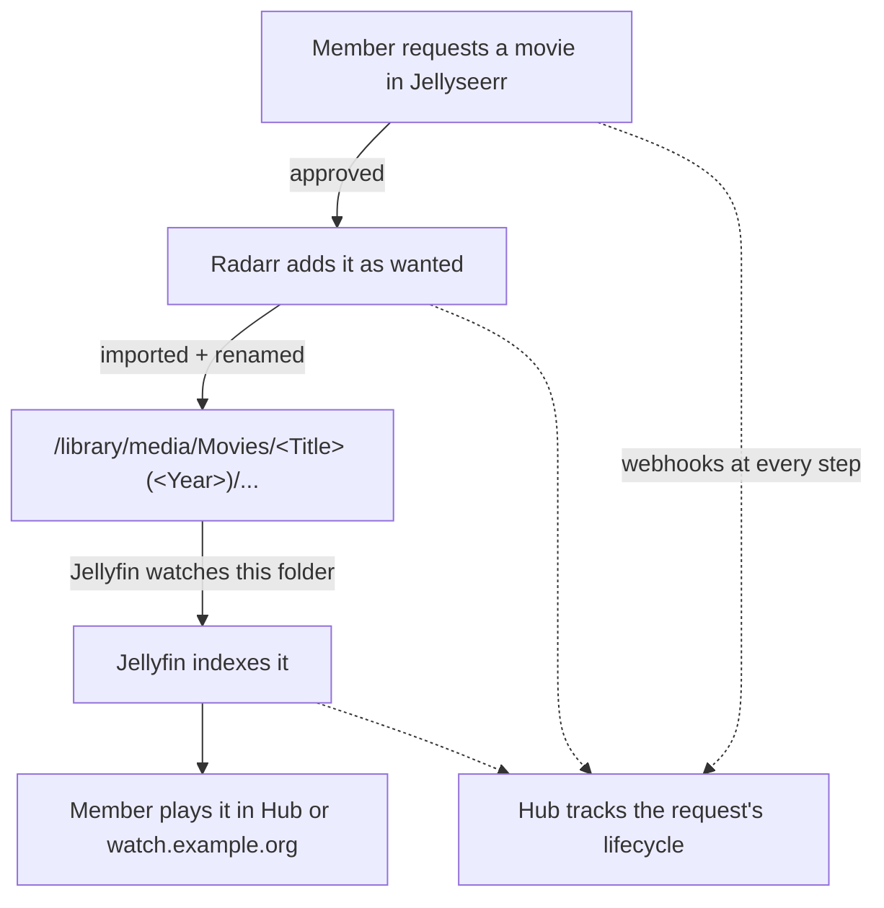

# Architecture

Self-Hosted Media Platform is organized in five layers. Each layer has one job and hands off
to the next through a well-defined boundary (a filesystem path, an HTTP API, or
an auth handshake).

## The five layers

1. **Library management** — Sonarr and Radarr track and organize TV and
   movies; the book library is curated by hand.
2. **Storage** — a single library tree on disk, shared by every container that
   reads or writes media (see [containerization](02-containerization-on-linux.md)).
3. **Media servers** — Jellyfin (video) and Kavita (books and comics) index
   the library tree and stream/serve to clients.
4. **Access** — Nginx Proxy Manager terminates TLS and routes each subdomain to
   the right service; Authentik enforces identity.
5. **Interaction** — Hub (the member site), Jellyseerr (requests) and a
   Discord bot let members find and request titles without shell access.

## Request-to-playback data flow

Using a movie as the example (TV is analogous):

The key design property: **library managers and media servers never talk to
each other directly.** They meet only at the shared library path. That keeps
the components decoupled — you can swap Radarr for something else without the
media server noticing, as long as files land in the same place.

## Network model

- **Public edge.** A wildcard DNS record points `*.example.org` at the home IP
  (DNS-only, no CDN proxy — video streams and game traffic don't belong behind a
  general-purpose CDN, and some CDN ToS forbid proxying video). A dynamic-DNS
  container keeps the record current as the residential IP changes.
- **TLS.** One wildcard certificate (`*.example.org`) issued via DNS-01
  challenge covers every subdomain, renewed automatically.
- **Reverse proxy.** Nginx Proxy Manager is the only thing exposed. It maps
  `watch/read/request/browse/id.example.org` to the relevant container's LAN
  address and port.
- **Admin plane.** Host administration is done over a private mesh VPN
  (e.g. Tailscale/WireGuard), never exposed publicly. Only the reverse proxy's
  80/443 are port-forwarded.

## Identity model

Authentik is the single source of truth for accounts. Each downstream app
integrates using whichever protocol gives the best user experience:

| App | Protocol | Why |
|---|---|---|
| Jellyfin | LDAP | Native login box works on every client (TV, mobile); existing profiles attach by matching username so watch history is preserved |
| Kavita | OIDC | First-class OIDC support; accounts auto-provision on first login |
| Jellyseerr | "Sign in with Jellyfin" | Rides Jellyfin's identity transitively |
| Hub | Jellyfin credentials, server-side session | Members sign in once with the account they already have |
| Internal tools with no login | Forward-auth (reverse proxy) | The proxy asks the SSO provider before the request reaches the app |

New members self-enroll through a Discord OAuth flow that provisions the
account and drops them into the right groups. Details in the
[SSO doc](04-sso-with-authentik.md).

## Why this shape

- **Decoupling via the filesystem** keeps each tool replaceable and makes
  failures local: a broken library manager can't take down playback.
- **Per-app auth protocol** trades a little extra setup for a genuinely
  seamless login experience across a heterogeneous stack.
- **A custom integration layer** (Hub) answers what no single tool can,
  such as "where is my request?", without replacing any of them.
