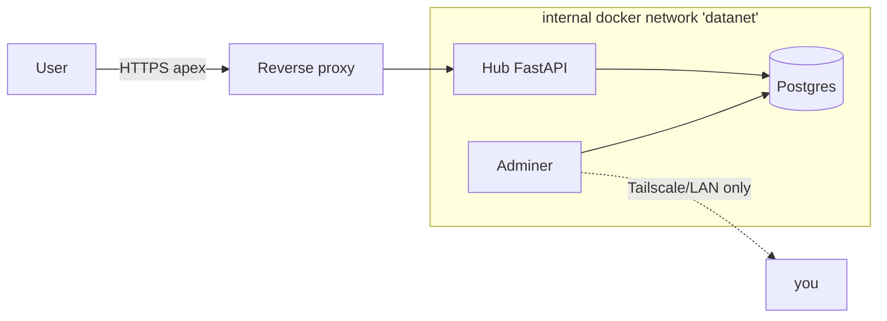

# Data Platform (Hub + Postgres)

The apex `example.org` is served by a small FastAPI **hub**: a forest-themed
landing page linking to every app, and the host for SQL/data projects. Behind
it sits a **dedicated Postgres** the hub queries.

## Why app-backed, not a static page
A static landing page is a dead end — it can only ever be a menu. A FastAPI hub
serves the landing page *and* grows into data dashboards: each project is a
router that queries Postgres and returns views. One stack, one deploy, one auth
model, reusing the same pattern as the custom request app.

## Network isolation



- Postgres publishes **no host port** — only containers on the `datanet`
  network reach it. It is never on the LAN/Tailscale/public interface.
- **Adminer** is the one window in, bound to a host port reachable via
  Tailscale/LAN only (not port-forwarded).
- The hub joins `datanet` and connects with
  `postgresql://<user>:<pass>@postgres:5432/<db>` (host = container name).
- A dedicated instance, **database/schema per project**, kept separate from the
  identity provider's own Postgres.

## Adding a project
1. Create a database/schema (via Adminer).
2. Add a router module under `backend/projects/` that uses the shared pool.
3. Register it in `app.py` and add a tile to the landing page.
4. Gate data dashboards with forward-auth (the landing menu stays public).

## Deploy sketch
```bash
docker network create datanet          # one-time, shared by both stacks
# postgres stack: set POSTGRES_PASSWORD, docker compose up -d
# hub stack: set DATABASE_URL to match, docker compose up -d --build
```
Portfolio framing: *self-hosted data platform — FastAPI + Postgres behind SSO,
isolated on a private Docker network, deployed via Compose.*
