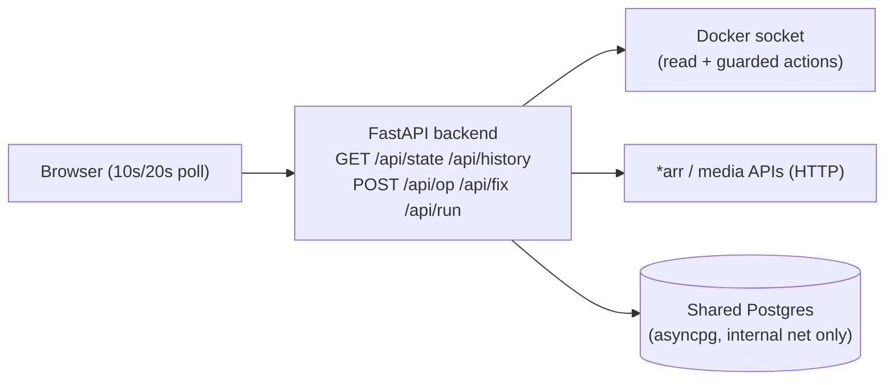

# DevOps console & monitoring

Two custom apps handle operations for the whole stack: **Hub** (the apex
landing page, also the host for live stats and SQL dashboards) and **DevOps
console** (a live monitoring + one-click admin dashboard for the operator).
Both are FastAPI + asyncpg. Neither is ever exposed publicly.

> For the full story of how DevOps console got to this architecture — including
> the design decisions, an unrelated base-image bug found along the way, and
> the verification approach used to ship a rewrite this consequential with zero
> downtime — see the separate deep dive:
> [ops-console-async-migration](https://github.com/sanseryf/ops-console-async-migration).
> This doc covers the *current* architecture, not the migration story.

## What DevOps console does

A single dashboard, LAN/VPN-reachable only, covering:

- **Live sampling**, every ~10 seconds: container health/CPU/RAM, library
  manager queue depth and missing counts, active streams, disk usage.
- **Slower-cycle checks**, every few minutes (or on demand): a file-system
  audit against the shared library, watch-history backfill from the media
  server's own playback log, account/signup diagnostics.
- **Guarded admin actions**: restart/start/stop/update a container, prune
  unused images, force a library scan, stop a runaway playback session, reset a member's password,
  grant a Discord role.
- **Read-only diagnostics**: a curated set of whitelisted shell/SQL commands
  (container listings, disk usage, largest/duplicate titles) runnable from the
  UI without opening a terminal — deliberately *not* free-form command
  execution.

## Why it's never public

Everything it can do is either sensitive (account internals, Discord role
grants) or consequential (container lifecycle). The perimeter is LAN/VPN
reachability, backed by a second layer: a shared-secret bearer token gates
every state-reading and state-changing endpoint, checked with a constant-time
comparison so token-guessing can't be timed. The token is opt-in — unset, auth
is a no-op — so it can't silently break an existing deployment, and it's
injected into the served page server-side rather than fetched separately, so
the browser's own requests can attach it automatically.

## Architecture

A background async task samples the stack on a fixed interval and holds the
latest snapshot in memory; every `GET` just returns a shallow copy of that
snapshot rather than triggering fresh work per request, so the dashboard stays
responsive even if one upstream service is slow.

## Single source of truth, not three independent checks

The four member-facing "doors" (watch/read/request/browse) used to be defined
three separate times — once in the landing page's markup, once in its status
collector, once in the admin console's own status collector — and pinged
independently by both apps on separate schedules. Two changes closed that:

1. **One config file**, owned by Hub, read by both apps (the admin console
   reads it over an existing read-only mount rather than duplicating it).
2. **One prober.** The admin console now asks Hub's own status collector for
   live up/down state first, and only falls back to probing the doors itself
   if Hub is unreachable — verified directly by stopping Hub mid-session and
   confirming the fallback engaged correctly, then restarting it and
   confirming it switched back.

## Data platform integration

DevOps console reads the same Postgres used by Hub's SQL dashboards (see
[Data platform](07-data-platform.md)) — audit summaries, duplicate/largest-title
reports, and a watch-history backfill job that imports from the media server's
own playback log so genre/hours stats reflect real usage, not just what the
admin console has observed since it started. All Postgres access is async
(`asyncpg`), matching Hub's own pattern rather than a separate driver.

## Possible improvements

- **Real-time push** (Server-Sent Events) to replace the current polling loops
  — deliberately scoped out of the last rewrite to keep that change's blast
  radius smaller; a natural follow-up now that the backend is fully async.
- **Structured audit log** of who ran which admin action and when, beyond what
  currently lands in container logs.
- **Typed request/response models** across the admin-action endpoints for a
  tighter contract with the frontend.
