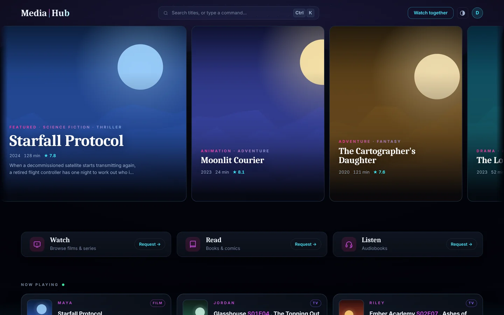
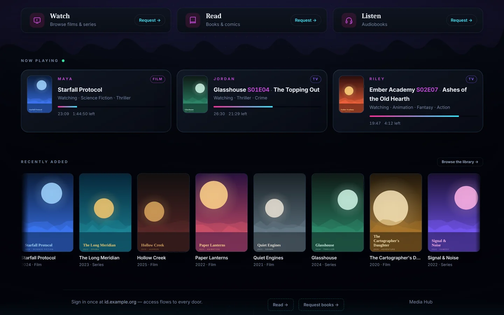
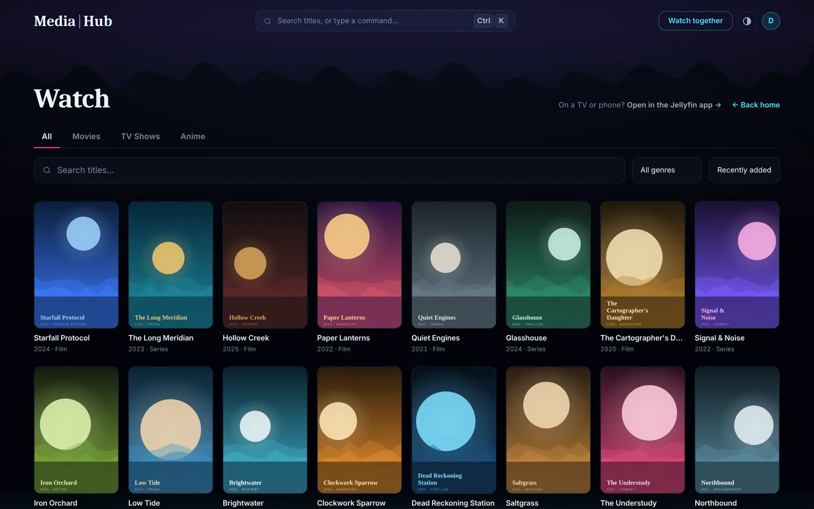
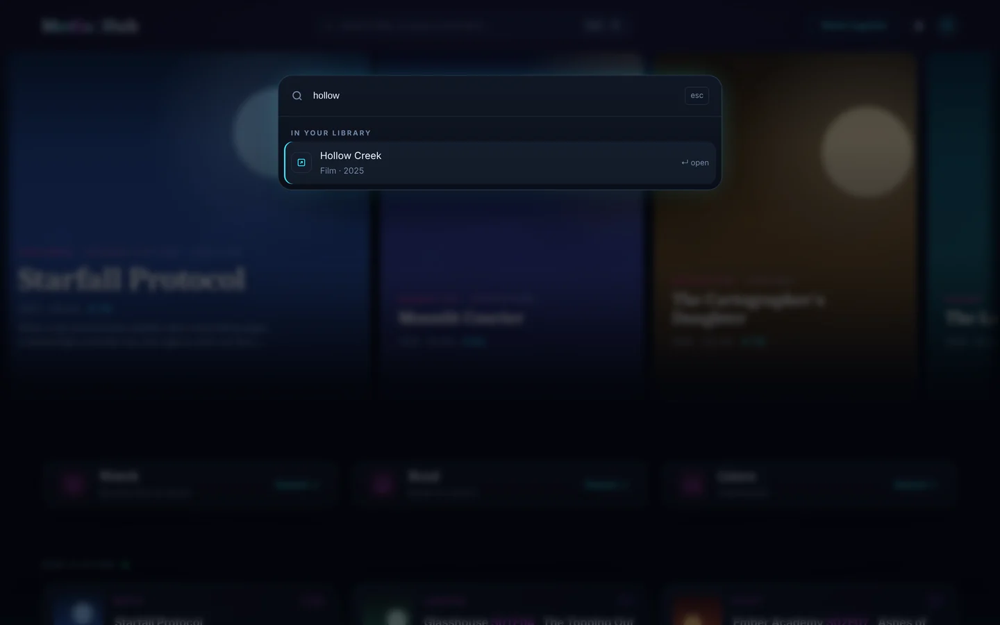
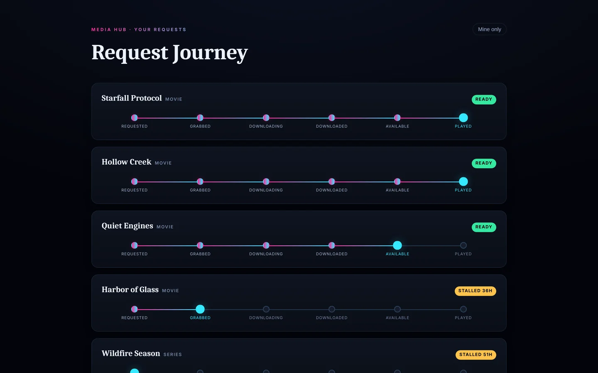
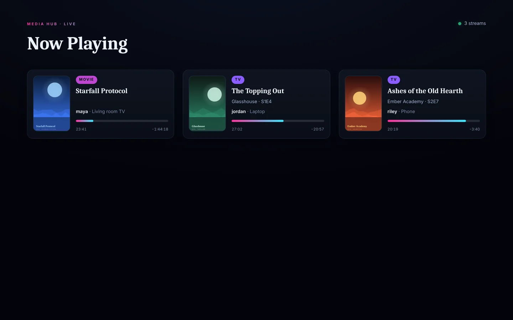
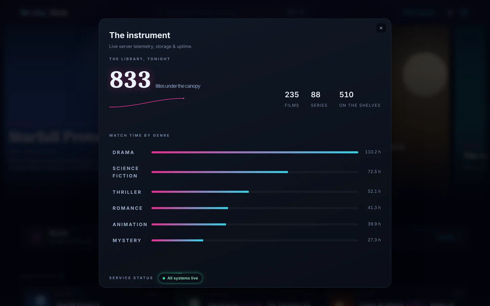
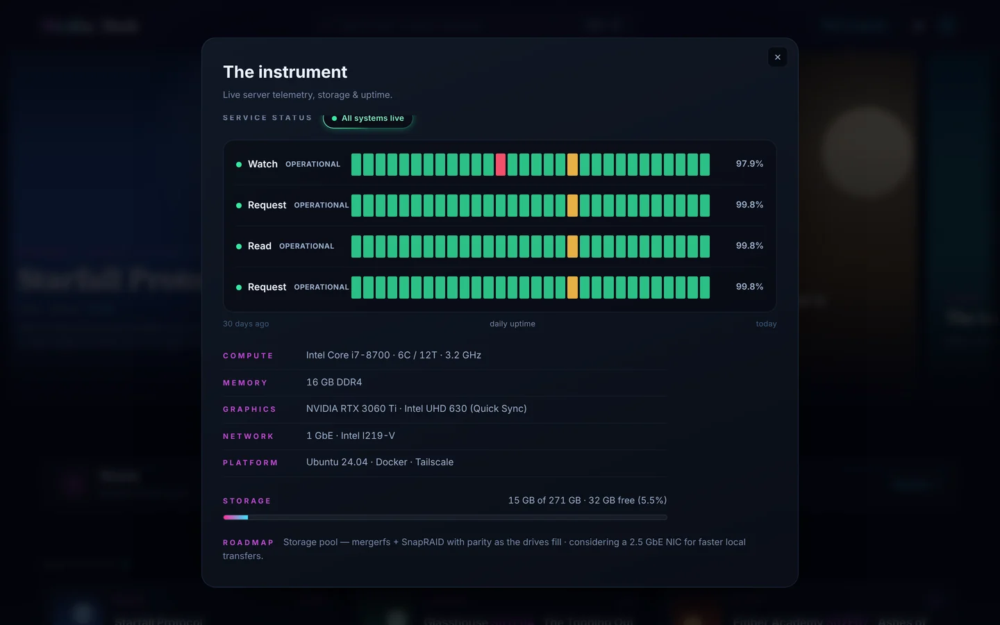

# Screenshots

All captured from the [demo](../../demo/). Every title, person and poster is
fictional, and the posters are generated SVGs.

| | |
|---|---|
|  **Home.** Featured rail and service doors |  **Now playing and recently added** |
|  **Catalog.** Library tabs, search, genre and sort |  **Command palette** (`Ctrl+K`) |
|  **Request journey.** State ladders with a stall flag |  **Live wall** over server-sent events |
|  **The instrument.** Growth and watch time by genre |  **Uptime board** and host spec |
